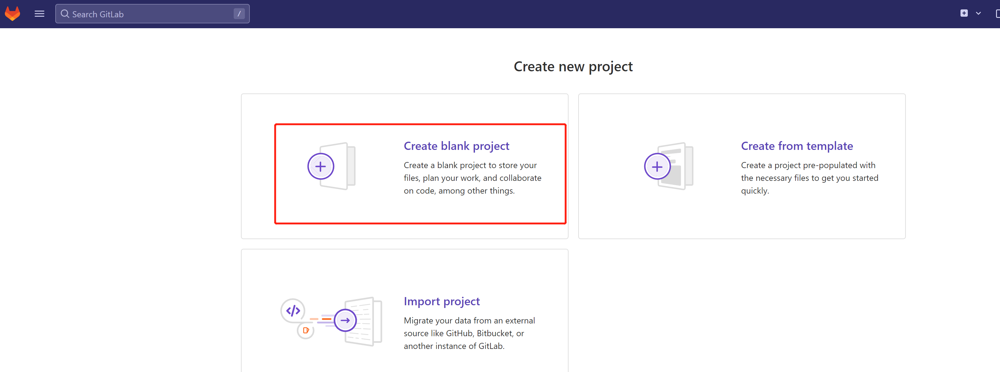

# Project Name: Gitlab CICD Pipeline
This project will show how to setup a Gitlab CICD pipeline, which will build the source code to a docker image and push it to the container registory in Gitlab and then re-deploy the docker container with the latest image in your local host.

# Project Goal
Understand how to setup/configure Gitlab as CICD pipeline. Familarize with gitlab pipeline.

# Table of Contents
1. [Prerequisites](#prerequisites)
2. [Project Steps](#project_steps)
3. [Post Project](#post_project)
4. [Troubleshooting](#troubleshooting)
5. [Reference](#reference)

# <a name="prerequisites">Prerequisites</a>
- Ubuntu 20.04 OS (Minimum 2 core CPU/8GB RAM/30GB Disk)
- Docker
- Docker Compose

# <a name="project_steps">Project Steps</a>
## 1. Run the docker containers with **docker-compose**
```bash
git clone https://github.com/zsb8/Devops.git
cd devopsdaydayup/003-GitlabCICD
docker-compose up -d
```


## 2. Add below entry in your **hosts** file (i.g. `/etc/hosts`). 
Once it is done, open your **browser** and go to https://<your_gitlab_domain_name>  (i.g. https://gitlab.chance20221020.com/)
```bash
<GITLAB SERVER IP>  <YOUR DOMAIN NAME in docker-compose.yaml> 
# For example
# 192.168.2.61 gitlab.chance20221020.com registry.gitlab.chance20221020.com
```

## 3. Login to your Gitlab web.
Wait for about **5 mins** for the server to fully start up. Then login to the **Gitlab website (YOUR_GITLAB_SERVER_IP)  such as https://192.168.50.164)** with the username `root` and the password defined in my `docker-compose.yaml`, which should be the value for env varible `GITLAB_ROOT_PASSWORD`. <br/>


Click **"New project"** to create your first project -> Click **"Create blank project"** -> Type your project name (such as 'CICD') in **"Project Name"** -> Select **"Public"** and click **"Create project"** -> Go to the new project you just created. <br/>
 
Go to the "projects" main menu. <br/>


Then Click your project, go to "Settings" -> "CI/CD" -> expand "Runners" section. <br/>


**Make a note** of **URL** and **registration token** in **"Specific runners"** section for below runner installation used <br/>


Make a note of Token as `GR1348941kL9sGnMECpYDKEgXMwj9`.

## 4. Update certificates
The contain 'gitlab/gitlab-ce:latest' named web, so you run `docker ps -f name=web`, will point to the gitlab/gitlab-ce.
```bash
docker ps -f name=web -q
```


Since the initial Gitlab server **certificate** is missing some info and cannot be used by Gitlab runner, we may have to **regenerate** a new one and **reconfigure** in the Gitlab server. Run below commands:
```bash
docker exec -it $(docker ps -f name=web -q) bash
mkdir /etc/gitlab/ssl_backup
mv /etc/gitlab/ssl/* /etc/gitlab/ssl_backup
cd /etc/gitlab/ssl
openssl genrsa -out ca.key 2048
openssl req -new -x509 -days 365 -key ca.key -subj "/C=CN/ST=GD/L=SZ/O=Acme, Inc./CN=Acme Root CA" -out ca.crt
```


Note: Make sure to replace below `YOUR_GITLAB_DOMAIN` with your own domain name. For example, chance20221020.com.
```bash
export YOUR_GITLAB_DOMAIN=chance20221020.com
openssl req -newkey rsa:2048 -nodes -keyout gitlab.$YOUR_GITLAB_DOMAIN.key -subj "/C=CN/ST=GD/L=SZ/O=Acme, Inc./CN=*.$YOUR_GITLAB_DOMAIN" -out gitlab.$YOUR_GITLAB_DOMAIN.csr
openssl x509 -req -extfile <(printf "subjectAltName=DNS:$YOUR_GITLAB_DOMAIN,DNS:gitlab.$YOUR_GITLAB_DOMAIN") -days 365 -in gitlab.$YOUR_GITLAB_DOMAIN.csr -CA ca.crt -CAkey ca.key -CAcreateserial -out gitlab.$YOUR_GITLAB_DOMAIN.crt

# Certificate for nginx (container registry)
openssl req -newkey rsa:2048 -nodes -keyout registry.gitlab.$YOUR_GITLAB_DOMAIN.key -subj "/C=CN/ST=GD/L=SZ/O=Acme, Inc./CN=*.$YOUR_GITLAB_DOMAIN" -out registry.gitlab.$YOUR_GITLAB_DOMAIN.csr
openssl x509 -req -extfile <(printf "subjectAltName=DNS:$YOUR_GITLAB_DOMAIN,DNS:gitlab.$YOUR_GITLAB_DOMAIN,DNS:registry.gitlab.$YOUR_GITLAB_DOMAIN") -days 365 -in registry.gitlab.$YOUR_GITLAB_DOMAIN.csr -CA ca.crt -CAkey ca.key -CAcreateserial -out registry.gitlab.$YOUR_GITLAB_DOMAIN.crt
exit
```


## 5. Enable **container register** 
Add below lines in the bottom of the file `/etc/gitlab/gitlab.rb`.   
Note: Make sure to replace below `YOUR_GITLAB_DOMAIN` with your own domain name. For example, chance20221020.com.    
```bash
docker exec -it $(docker ps -f name=web -q) bash
export YOUR_GITLAB_DOMAIN=chance20221020.com
cat >> /etc/gitlab/gitlab.rb <<EOF

 registry_external_url 'https://registry.gitlab.$YOUR_GITLAB_DOMAIN:5005'
 gitlab_rails['registry_enabled'] = true
 gitlab_rails['registry_host'] = "registry.gitlab.$YOUR_GITLAB_DOMAIN"
 gitlab_rails['registry_port'] = "5005"
 gitlab_rails['registry_path'] = "/var/opt/gitlab/gitlab-rails/shared/registry"
 gitlab_rails['registry_api_url'] = "http://127.0.0.1:5000"
 gitlab_rails['registry_key_path'] = "/var/opt/gitlab/gitlab-rails/certificate.key"
 registry['enable'] = true
 registry['registry_http_addr'] = "127.0.0.1:5000"
 registry['log_directory'] = "/var/log/gitlab/registry"
 registry['env_directory'] = "/opt/gitlab/etc/registry/env"
 registry['env'] = {
   'SSL_CERT_DIR' => "/opt/gitlab/embedded/ssl/certs/"
 }
 # Note: Make sure to update below 'rootcertbundle' default value 'certificate.crt" to 'gitlab-registry.crt', otherwise you may get error.
 registry['rootcertbundle'] = "/var/opt/gitlab/registry/gitlab-registry.crt"
 nginx['ssl_certificate'] = "/etc/gitlab/ssl/registry.gitlab.$YOUR_GITLAB_DOMAIN.crt"
 nginx['ssl_certificate_key'] = "/etc/gitlab/ssl/registry.gitlab.$YOUR_GITLAB_DOMAIN.key"
 registry_nginx['enable'] = true
 registry_nginx['listen_port'] = 5005
EOF

# Reconfigure the gitlab to apply above change
gitlab-ctl reconfigure
gitlab-ctl restart
exit
```

Run `gitlab-ctl reconfigure` command.

Run `gitlab-ctl restart` command.


## 6. Update certificates for docker client
In order to make **docker login** work, you need to add the **certificate** in docker certs folder.    
Login the host you are going to run the docker commands.    
```bash
export YOUR_GITLAB_DOMAIN=chance20221020.com
sudo mkdir -p /etc/docker/certs.d/registry.gitlab.$YOUR_GITLAB_DOMAIN:5005
sudo docker cp $(docker ps -f name=web -q):/etc/gitlab/ssl/registry.gitlab.$YOUR_GITLAB_DOMAIN.crt /etc/docker/certs.d/registry.gitlab.$YOUR_GITLAB_DOMAIN:5005/
sudo ls /etc/docker/certs.d/registry.gitlab.$YOUR_GITLAB_DOMAIN:5005
```


Test docker login and you should be able to login now.     
```bash
docker login registry.gitlab.$YOUR_GITLAB_DOMAIN:5005
Username: root
Password: changeme
```


You can also test if the docker image push works once login successfully.     
Login to your Gitlab server web UI and go to the project you created, and then go to "Packages and registries" -> "Container Registry", you should be able to see the valid registry URL you suppose to use in order to build and push your image. For example, `docker build -t registry.gitlab.chance20221020.com:5005/gitlab-instance-80b162cc/cicd .` (cicd is your project name which was defined before) (See below screenshot)    


Run `docker build -t registry.gitlab.chance20221020.com:5005/gitlab-instance-80b162cc/cicd .`:  


Run `docker push registry.gitlab.chance20221020.com:5005/gitlab-instance-80b162cc/cicd`  :


Login to your Gitlab server web UI and go to the project you created, and then go to "Packages and registries" -> "Container Registry", you should be able to see the valid registry.    


## 7. Configure **gitlab-runner** 
Login to gitlab-runner and run commands below:
```bash
export YOUR_GITLAB_DOMAIN=chance20221020.com
docker exec $(docker ps -f name=web -q) cat /etc/gitlab/ssl/gitlab.$YOUR_GITLAB_DOMAIN.crt
docker exec $(docker ps -f name=web -q) cat /etc/gitlab/ssl/registry.gitlab.$YOUR_GITLAB_DOMAIN.crt
docker exec -it $(docker ps -f name=gitlab-runner -q) bash
cat > /usr/local/share/ca-certificates/gitlab-server.crt <<EOF
# <Paste above gitlab server certificate here>
EOF

cat > /usr/local/share/ca-certificates/registry.gitlab-server.crt <<EOF
# <Paste above gitlab registry certificate here>
EOF
```


```bash
update-ca-certificates
gitlab-runner register 
# Enter the GitLab instance URL (for example, https://<YOUR_GITLAB_DOMAIN>(i.g. https://gitlab.chance20221020.com)

Enter the registration token:
<Paste the token retrieved in Step 3>
```


```bash
Enter a description for the runner:
[bad518d25b44]: test

Enter tags for the runner (comma-separated):
test

Enter optional maintenance note for the runner:
test

Registering runner... succeeded                     runner=GR1348941Pjv5Qzaz
Enter an executor: ssh, docker+machine, docker-ssh, docker, parallels, shell, virtualbox, docker-ssh+machine, kubernetes, custom:
shell
```


If success, you will see below message:
```
Runner registered successfully. Feel free to start it, but if it's running already the config should be automatically reloaded!
Configuration (with the authentication token) was saved in "/etc/gitlab-runner/config.toml" 
```
Once you finish above step, you should be able to see an available running in the project's CICD Runners section (see below screenshoot).

```bash
root@bad518d25b44:/usr/local/share/ca-certificates# cat /etc/gitlab-runner/config.toml 
```


You must change the `docker.sock` permission by `chmode 777 docker.sock` command in /var/run/ folder.     

If you don't change the 777 permission, you will meet ''  errro during the pipeline.      


## 8. Copy necessary files into Gitlab project repo.
**git clone** from your Gitlab project repo to your local host and copy necessary files from our devopsdaydayup lab repo (in the same folder as this README.md)
```bash
git clone <URL from your gitlab server repo>
```


You need to at your project name folder (/home/devopsdaydayup/cicd) in the local host (192.168.50.164). 
Then you copy the files from '003-GitlabCICD' folder to you current folder. 
```bash 
cd <your project name folder>
cp /path/to/devopsdaydayup/003-GitlabCICD/.  <your gitlab repo>
```


```bash
git add .
git commit -am "First"
git push
```


Once you push the code, you should be able to see the pipeline is automatically triggered under the project -> "CI/CD" -> "Jobs"


## 9. Verification

  a. Check your hello-world container by visiting the **website** http://<HOST IP which is running the docker-compose.yaml>:8080 <br/>
  b. In your **gitlab repo**, update `return "Hello World!"` in `app.py` file. For example, update to `return "Hello World 2022!"`. Save the change and `git add .` and `git commit -am "Update code"` and then `git push`.<br/> 
  c. Once the CICD pipeline is completed, you can visit your hello-world web again to see if the content is changed. http://<HOST IP which is running the docker-compose.yaml>:8080 <br/>

# <a name="post_project">Post Project</a>

# <a name="troubleshooting">Troubleshooting</a>

## Issue 1: check that a DNS record exists for this domain
Error out when starting up or reconfigure the gitlab server 

```
RuntimeError: letsencrypt_certificate[gitlab.chance20221020.com] (letsencrypt::http_authorization line 6) had an error: RuntimeError: acme_certificate[staging] (letsencrypt::http_authorization line 43) had an error: RuntimeError: ruby_block[create certificate for gitlab.chance20221020.com] (letsencrypt::http_authorization line 110) had an error: RuntimeError: [gitlab.chance20221020.com] Validation failed, unable to request certificate, Errors: [{url: https://acme-staging-v02.api.letsencrypt.org/acme/chall-v3/4042412034/SuXaFQ, status: invalid, error: {"type"=>"urn:ietf:params:acme:error:dns", "detail"=>"DNS problem: NXDOMAIN looking up A for gitlab.chance20221020.com - check that a DNS record exists for this domain; DNS problem: NXDOMAIN looking up AAAA for gitlab.chance20221020.com - check that a DNS record exists for this domain", "status"=>400}} ]
```
**Solution:**
Sometimes it will occur when letsencrypt is requesting for a old/used DNS record. Just give it another 15 mins to see if it will figure it out by itself. If no, You can try to reconfigure/restart the gitlab server without any change. If it doesn't work either, you can replace your gitlab domain name in `docker-compose.yaml` with more unique name and then reconfigure/restart your gitlab server.

## Issue 2: Cannot register gitlab-runner: connection refused
When running `gitlab-register`, it shows below error:

```
ERROR: Registering runner... failed                 runner=GR1348941oqts-yxX status=couldn't execute POST against https://gitlab.chance20221020.com/api/v4/runners: Post "https://gitlab.chance20221020.com/api/v4/runners": dial tcp 0.0.0.0:443: connect: connection refused
```

**Solution:**
Make sure to follow step 4 to regerate a new certificate with proper info and update it in gitlab-runner host/container

## Issue 3: Cannot login docker registry: x509: certificate signed by unknown authority
Cannot `docker login` to the gitlab container registry. Below error is returned

```
$ docker login registry.gitlab.chance20221020.com:5005
Username: root
Password: 
Error response from daemon: Get "https://registry.gitlab.chance20221020.com:5005/v2/": x509: certificate signed by unknown authority
```
**Cause:**
You are using a self-signed certificate for your gitlab container registry instead of the certificate issued by a trusted CA. The docker daemon doesnot trust the self-signed cert which causes this error

**Solution:**
You must instruct docker to trust the self-signed certificate by copying the self-signed certificate to `/etc/docker/certs.d/<your_registry_host_name>:<your_registry_host_port>/ca.crt` on the machine where running the docker login command. 
```
export YOUR_GITLAB_DOMAIN=chance20221020.com
export YOUR_GITLAB_CONTAINER=<Gitlab Container ID>

sudo mkdir -p /etc/docker/certs.d/registry.gitlab.$YOUR_GITLAB_DOMAIN:5005
sudo docker cp $YOUR_GITLAB_CONTAINER:/etc/gitlab/ssl/ca.crt /etc/docker/certs.d/registry.gitlab.$YOUR_GITLAB_DOMAIN:5005
```

## Issue 4: x509: certificate signed by unknown authority
when running `gitlab-runner registry`, failing with below error
```
ERROR: Registering runner... failed                 runner=GR1348941oqts-yxX status=couldn't execute POST against https://gitlab.chance20221020.com/api/v4/runners: Post "https://gitlab.chance20221020.com/api/v4/runners": x509: certificate signed by unknown authority
```
> Refer to:
> https://www.ibm.com/docs/en/cloud-paks/cp-management/2.2.x?topic=tcnm-logging-into-your-docker-registry-fails-x509-certificate-signed-by-unknown-authority-error
> https://7thzero.com/blog/private-docker-registry-x509-certificate-signed-by-unknown-authority

## Issue 5: This job is stuck because the project doesn't have any runners online assigned to it.
When running the gitlab pipeline, the job gets stuck with below error
```
This job is stuck because the project doesn't have any runners online assigned to it
```
**Cause:**
Check if any gitlab runner is online. If so, most likely the job is stuck because your runners have tags but your jobs don't.

**Solution:**
You need to enable your runner without tags. Go to your project and go to "Settings" -> "CI/CD" -> Click the online gitlab runner -> Check "Indicates whether this runner can pick jobs without tags". Then your pipeline should be able to pick this runner.


> Refer to: https://stackoverflow.com/questions/53370840/this-job-is-stuck-because-the-project-doesnt-have-any-runners-online-assigned


# <a name="reference">Reference</a>
[Install Gitlab using docker compose](https://docs.gitlab.com/ee/install/docker.html#install-gitlab-using-docker-compose) <br/>
[Runner Cannot Register with error: x509: certificate relies on legacy Common Name field, use SANs instead](https://gitlab.com/gitlab-org/gitlab-runner/-/issues/28841)<br/>
[Enable Container Registry](https://blog.programster.org/dockerized-gitlab-enable-container-registry)<br/>
[List all Gitlab pipeline environment variables](https://docs.gitlab.com/ee/ci/variables/)<br/>

