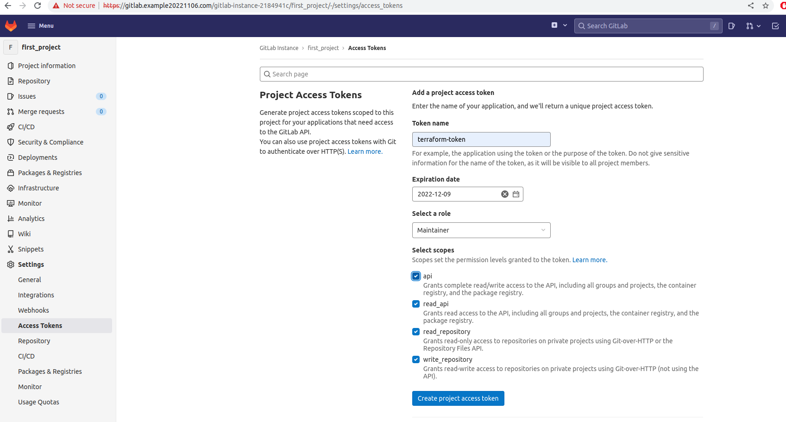
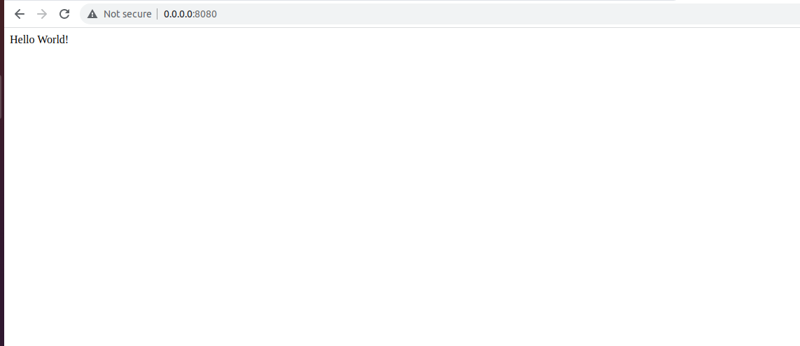

# Project Name: Deploy Docker with Terraform Script

# Project Goal
In this article, you will learn the terraform basic usage and use terraform script to create a docker container.

# Table of Contents
1. [Prerequisites](#prerequisites)
2. [Project Steps](#project_steps)
3. [Post Project](#post_project)
4. [Troubleshooting](#troubleshooting)
5. [Reference](#reference)

# <a name="prerequisites">Prerequisites</a>
- Ubuntu 20.04 OS (Minimum 2 core CPU/8GB RAM/30GB Disk)
- Docker (see installation guide [here](https://docs.docker.com/get-docker/))
- Docker Compose (see installation guide [here](https://docs.docker.com/compose/install/))
- Terraform (see installation guide [here](https://developer.hashicorp.com/terraform/tutorials/aws-get-started/install-cli))
- Gitlab (Not really Gitlib. It is built in you VM Ubuntu for easily to test).

# <a name="project_steps">Project Steps</a>

## 1. Deploy a gitlab server to store the terraform state file
```bash
git clone https://github.com/chance2021/devopsdaydayup.git
cd devopsdaydayup/004-TerraformDockerDeployment
docker-compose up -d
```
> Note: Once the gitlab container is fully up running, you can run below command to retrieve the initial password, if you haven't specified it in the deployment file. The default admin username should be `root`
```
sudo docker exec -it gitlab grep 'Password:' /etc/gitlab/initial_root_password
```

EqTvlWRmvIEBNm9W5Jx15aU7hyGJTGh2YZg/TuNZiqc=

## 2. Add the new DNS record in your local hosts file
In your `docker-compose.yaml`, you have defined your gitlab server hostname in `hostname` field. 


Add it to your local hosts (Ubuntu)  file so that you can use it to git clone the repo from your gitlab server.

```bash
export Your_Local_Host_IP=<Your_Local_Host_IP>
echo "${Your_Local_Host_IP}  gitlab.<Your_Gitlab_Hostname>" |sudo tee -a /etc/hosts
i.g.
echo "${Your_Local_Host_IP}  gitlab.example20221106.com" |sudo tee -a /etc/hosts
```


Then you should be able to access the Gitlab website via `https://gitlab.example20221106.com` in your Ubuntu.

In the web page, you input the username (root) and password ( EqTvlWRmvIEBNm9W5Jx15aU7hyGJTGh2YZg/TuNZiqc= ), then you can login the gitlab whiched buit in you Ubuntu.
## 3. Update the Gitlab original Certificate
Since the initial Gitlab server **certificate** is missing some info, you may have to **regenerate** a new one and **reconfigure** in the gitlab server. Run below commands:
```bash
docker exec -it gitlab bash
mkdir /etc/gitlab/ssl_backup
mv /etc/gitlab/ssl/* /etc/gitlab/ssl_backup
cd /etc/gitlab/ssl
openssl genrsa -out ca.key 2048
openssl req -new -x509 -days 365 -key ca.key -subj "/C=CN/ST=GD/L=SZ/O=Acme, Inc./CN=Acme Root CA" -out ca.crt

# Note: Make sure to replace below `YOUR_GITLAB_DOMAIN` with your own domain name. For example, example20221106.com.
# Certificate for gitlab server
export YOUR_GITLAB_DOMAIN=example20221106.com
openssl req -newkey rsa:2048 -nodes -keyout gitlab.$YOUR_GITLAB_DOMAIN.key -subj "/C=CN/ST=GD/L=SZ/O=Acme, Inc./CN=*.$YOUR_GITLAB_DOMAIN" -out gitlab.$YOUR_GITLAB_DOMAIN.csr
openssl x509 -req -extfile <(printf "subjectAltName=DNS:$YOUR_GITLAB_DOMAIN,DNS:gitlab.$YOUR_GITLAB_DOMAIN") -days 365 -in gitlab.$YOUR_GITLAB_DOMAIN.csr -CA ca.crt -CAkey ca.key -CAcreateserial -out gitlab.$YOUR_GITLAB_DOMAIN.crt

# Certificate for container registry
openssl req -newkey rsa:2048 -nodes -keyout registry.gitlab.$YOUR_GITLAB_DOMAIN.key -subj "/C=CN/ST=GD/L=SZ/O=Acme, Inc./CN=*.$YOUR_GITLAB_DOMAIN" -out registry.gitlab.$YOUR_GITLAB_DOMAIN.csr
openssl x509 -req -extfile <(printf "subjectAltName=DNS:$YOUR_GITLAB_DOMAIN,DNS:gitlab.$YOUR_GITLAB_DOMAIN,DNS:registry.gitlab.$YOUR_GITLAB_DOMAIN") -days 365 -in registry.gitlab.$YOUR_GITLAB_DOMAIN.csr -CA ca.crt -CAkey ca.key -CAcreateserial -out registry.gitlab.$YOUR_GITLAB_DOMAIN.crt
gitlab-ctl reconfigure
gitlab-ctl restart
exit
```
## 4.Import the gitlab new certificate in your local host CA chains
In order to make your local host be able to talk to the gitlab server via TLS, you have to import the new gitlab certificate, which is generated previous step, into your local host CA store chains. Login to your local host and run below command:
```bash
export YOUR_GITLAB_DOMAIN=example20221106.com
sudo docker cp gitlab:/etc/gitlab/ssl/gitlab.$YOUR_GITLAB_DOMAIN.crt /usr/local/share/ca-certificates/
sudo update-ca-certificates
```

## 5. Create a new project in your Gitlab server and generate a personal access token
Login to your Gitlab server website (`https://<Your_Gitlab_Hostname>`) and Click **"New project"** -> **"Create blank project"** -> Type a project name in **"Project name"**, i.g. *first_project*  , select **"Public"** in **Visiblity Level** section -> Click **"Create project"** </br>

Once the project is create, go to the new project -> **"Setting""** -> **"Access Tokens"** -> Type a customized token name in **Token name** field, i.ig  *terraform-token* , Select a role **"Maintainer"** in *Select a role field*, Select scopes **"api/read_api/read_repositry/write_repository"** </br>

Make a note of the new token generated as you will need to apply it in the next step



## 6. Update `config.tfbackend`
Before running `terraform init`, you have to update `config/test/config.tfbackend` file with the credential/gitlab server info accordingly. The below is the definition for the variables:</br>

**PROJECT_ID:** Go to the project and head to **"Setting"** -> **"General"**, and you will see **"Project ID"** in the page. </br>
**TF_USERNAME:** If you haven't created your own user, the default user should be `root` </br>
**TF_PASSWORD:** This is the gitlab **personal access token**, which you can fetch from previous step </br>
**TF_ADDRESS:** This is URL to store your **terraform state file**. The pattern is like `https://<your gitlab server url>/api/v4/projects/<your project id>/terraform/state/old-state-name`. For example: 
`https://gitlab.com/api/v4/projects/${PROJECT_ID}/terraform/state/old-state-name`

## 7. Run terraform script to deploy the infra
**Init**
```
terraform init -backend-config=config/test/config.tfbackend
```
**Plan**
```
terraform plan -var-file=config/test/test.tfvars -out deploy.tfplan
```
**Apply**
```
terraform apply deploy.tfplan
```

## 8. Verification
You should be able to visit the website via `http://0.0.0.0:8080`



# <a name="post_project">Post Project</a>
Delete the terraform infra
```bash
terraform destroy -var-file=config/test/test.tfvars 
```
Delete the gitlab container, as well as the volumes mounted
```bash
docker-compose down -v
```
Delete the test container if exists
```bash
docker rm -f terraform-docker-example
```


# <a name="troubleshooting">Troubleshooting</a>
## Issue 1:
Gitlab container fails to start with below error:
```
FATAL: RuntimeError: letsencrypt_certificate[gitlab.example20221106.com] (letsencrypt::http_authorization line 6) had an error: RuntimeError: acme_certificate[staging] (letsencrypt::http_authorization line 43) had an error: RuntimeError: ruby_block[create certificate for gitlab.example20221106.com] (letsencrypt::http_authorization line 110) had an error: RuntimeError: [gitlab.example20221106.com] Validation failed, unable to request certificate, Errors: [{url: https://acme-staging-v02.api.letsencrypt.org/acme/chall-v3/4232409884/gZZ9tw, status: invalid, error: {"type"=>"urn:ietf:params:acme:error:dns", "detail"=>"DNS problem: NXDOMAIN looking up A for gitlab.example20221106.com - check that a DNS record exists for this domain; DNS problem: NXDOMAIN looking up AAAA for gitlab.example20221106.com - check that a DNS record exists for this domain", "status"=>400}} ]

```
**Solution:**
The issue should be fixed by restarting the container (by default it will restart by itself once fail). If still doesn't work, just remove the container as well as the volumes, and then redeploy the docker compose again.

# <a name="reference">Reference</a>
[Build Infrastructure - Terraform Docker Example](https://developer.hashicorp.com/terraform/tutorials/docker-get-started/docker-build) </br>
[Backends Configuration](https://developer.hashicorp.com/terraform/language/settings/backends/configuration)</br>
[Install Gitlab Docker Compose](https://docs.gitlab.com/ee/install/docker.html)</br>
[GitLab-managed Terraform state](https://docs.gitlab.com/ee/user/infrastructure/iac/terraform_state.html)</br>
[Terraform state administration](https://docs.gitlab.com/ee/administration/terraform_state.html)</br>
[Terraform Setttings Backends http](https://developer.hashicorp.com/terraform/language/settings/backends/http)</br>
